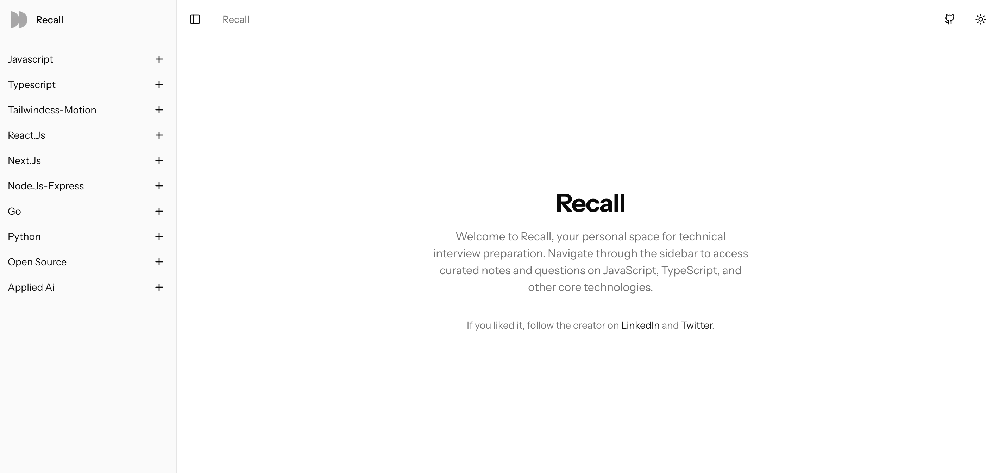

<div align="center">



# Recall

**Your personal space for technical interview preparation.**

Navigate through curated notes and questions on JavaScript, TypeScript, React, Next.js, Go, Python, and other core technologies — all organized and ready to help you ace your next interview.

</div>

---

## 🛠️ Tech Stack

| Category       | Technology                                                                                                                                                                        |
| -------------- | --------------------------------------------------------------------------------------------------------------------------------------------------------------------------------- |
| **Framework**  | [Next.js 16](https://nextjs.org/) with App Router                                                                                                                                 |
| **Language**   | [TypeScript 5](https://www.typescriptlang.org/)                                                                                                                                   |
| **UI Library** | [React 19](https://react.dev/)                                                                                                                                                    |
| **Styling**    | [Tailwind CSS 4](https://tailwindcss.com/) · [Framer Motion](https://www.framer.com/motion/)                                                                                      |
| **Components** | [Radix UI](https://www.radix-ui.com/) · [shadcn/ui](https://ui.shadcn.com/) · [Lucide Icons](https://lucide.dev/)                                                                 |
| **Markdown**   | [react-markdown](https://github.com/remarkjs/react-markdown) · [remark-gfm](https://github.com/remarkjs/remark-gfm) · [gray-matter](https://github.com/jonschlinkert/gray-matter) |
| **State**      | [Redux Toolkit](https://redux-toolkit.js.org/) · [React Redux](https://react-redux.js.org/)                                                                                       |
| **Theming**    | [next-themes](https://github.com/pacocoursey/next-themes)                                                                                                                         |

## 🚀 Getting Started

```bash
# Clone the repository
git clone https://github.com/dhanush27/recall.git
cd recall

# Install dependencies
bun install

# Start the development server
bun dev
```

Open [http://localhost:3000](http://localhost:3000) to view it in the browser.

---

<div align="center">

Made by **Dhanush**

[](https://www.linkedin.com/in/dhanush27/)
[](https://x.com/orcatwt)

</div>
